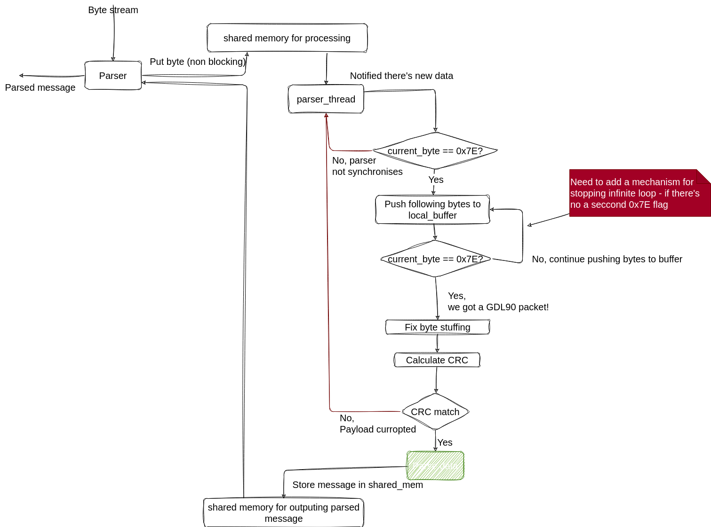

# GLD90_parser

A GDL90 parser with extension to support SAE J1939 protocol

**TDD approach** - Since I had no idea what these two protocols are, I used excessive unittesting on the way

## Questions

1. According to GDL90 documentation - it allows maximum 3.8 [KB/s], embedding within GDL90 a SAE J1939 protocol (that allows 500 Kb/s) will cause a bottle neck tho the underlined protocol. Why have you choose this implementation?
2. GDL90s "Pass-through" mode - how it filters messages besed on distance from ownship?:

    ```text
    The second interface is the “Pass-through” interface. This interface does not provide conflict
    alerts. The output reports under this interface consist of the message payloads that are received
    over the UAT data link, without modification. Due to constraints on the interface bandwidth,
    received UAT messages are filtered by range from ownship
    ```

## Design



1. Selecting buffer size of **2100 bytes**
   Size of the memory-mapped region
   Although GDL 90 has no limitation, I used the embedded SAE J1939 protocol as upper bound messages - 1785 Bytes + 100 Bytes for the mutexes ([SAE J1939 protocol](https://www.typhoon-hil.com/documentation/typhoon-hil-software-manual/References/j1939_protocol.html#:~:text=J1939%20defines%20the%20maximum%20message,sequence%208%20byte%20size%20messages.))
2. Using the provided crc calculation from the GDL90 doc
   I did that purely to stick with the protocol. There are others a bit more optimized in term of resource initialization.
3. Using shared-memory-struct over shared-memory-map:
   - Simplicity:  
        Shared memory segments can be simpler to set up and use for basic IPC, especially for small, fixed-size data structures.
   - Performance:  
        Shared memory segments offer high performance with minimal overhead since the memory is directly accessible by all involved processes. There is no need for OS involvement once the memory is mapped.
   - Low Latency:  
        Shared memory segments provide low-latency communication, which is critical for real-time applications.

### Things I would like to do but have no time

1. Change the buffer to cyclic buffer - this way I can always in-stream bytes, and out-parse them without interrupts

## Compile

```shell
mkdir build && cd build                                                                                                                                                                     
cmake .. && make -j $(nproc)  
```

## Run tests

I used Ctest with _unity_ testing infrastructure, for portability - I fetch _unity_ it at Cmake time (it happens once, but requires internet connection)

```shell
# Run all tests
ctest -j14 -C Debug -T test --output-on-failure
# Run specific test
ctest -j14 -C Debug -T test --output-on-failure -R ^test_gdl90_parser
```
