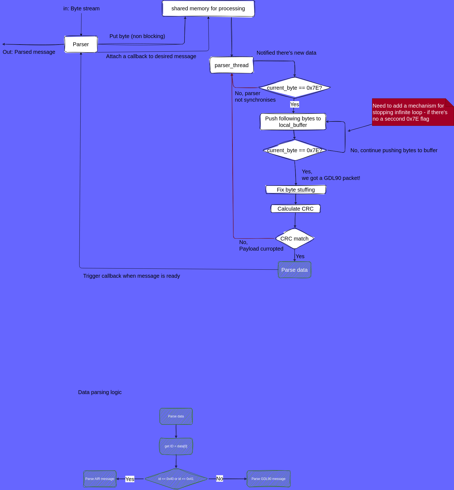

# GLD90_parser

A GDL90 parser with extension to support SAE J1939 protocol

## Design



## Compile

```shell
mkdir build && cd build                                                                                                                                                                     
cmake .. && make -j $(nproc)  
```

## Run tests

I used Ctest  with unity testing infrastructure, for portability - I bring it at Cmake time

```shell
# Run specific test
ctest -j14 -C Debug -T test --output-on-failure -R ^test_gdl_90_parser
```
